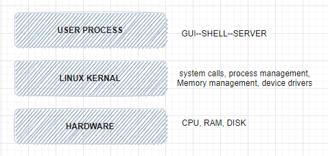
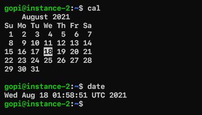
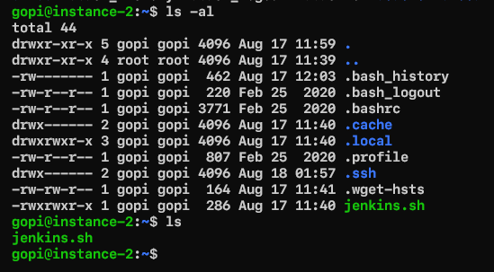
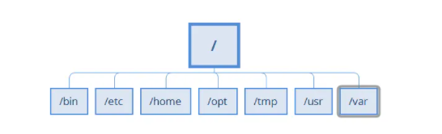

### **Linux**  
---
### **what is Linux**
Linux® is an open source operating system (OS). An operating system is the software that directly manages a system’s hardware and resources, like CPU, memory, and storage. The OS sits between applications and hardware and makes the connections between all of your software and the physical resources that do the work.  

Think about an OS like a car engine. An engine can run on its own, but it becomes a functional car when it’s connected with a transmission, axles, and wheels. Without the engine running properly, the rest of the car won’t work.  
### **How does Linux work**  
Linux was designed to be similar to UNIX, but has evolved to run on a wide variety of hardware from phones to supercomputers. Every Linux-based OS involves the Linux kernel—which manages hardware resources—and a set of software packages that make up the rest of the operating system.  

The OS includes some common core components, like the GNU tools, among others. These tools give the user a way to manage the resources provided by the kernel, install additional software, configure performance and security settings, and more. All of these tools bundled together make up the functional operating system. Because Linux is an open source OS, combinations of software can vary between Linux distributions.  
### **What is the commandline**  
The command line is your direct access to a computer. It's where you ask software to perform hardware actions that point-and-click graphical user interfaces (GUIs) simply can't ask. 

Command lines are available on many operating systems—proprietary or open source. But it’s usually associated with Linux, because both command lines and open source software, together, give users unrestricted access to their computer.  

- **`Distro` = Linux + software sute of applications + devloper tools**  
- in the essence **`Kernal`** core of the operationg system.  

### **Layers of Abstraction in Linux**  

  
**kernel is charge for managing**  

- process
- memeory
- device drivers
- system calls (fork,exec)  

**user space**  
kernal allocate memory for user processes and this is called as user sapce.  
**user**  
user an entity that can run processes and own files.  
**shell and terminal**  
- when we speak of the command line we are refeering to shell. shell is a program takes commands and process them to as to carry out
- almost all the distibutions a shell program called as bash is supplied.
-   to intract with shell we need a terminal.  

**standard input and standard output**  
- Linux Processes use I/O streams to read and write data.
- Streams are very flexible, the source of input stream can be a file, device or it can be even the output stream of other process.  
**Linux Commands**  
In the shell prompt we generally execute commands. Lets execute some simple commands.  
ex:  
```
date
cal
```
  

**Basic command syntax**
```
<command> <args>
echo hello
```
**Arguments of two types**  
-  Positional arguments:
```
<command> <arg1> <arg2>
cp 1.txt 2.txt
```
**Named arguments**  
```
<command> --<argname> <argumentvalue>
ping -c 4 google.com 
```
***ls*** : this command is used to list the contents of the directory
```
ls
ls -a
```
  
touch: this command creates an empty file
```
touch 2.txt
```
cp: this command copies files
```
cp file1 file2
```
mv : this command moves (rename) the files  
rm  
echo  

Linux directory hierarchy  
- Linux directory  

  
- / => root directory
- /bin => Binaries and other executables
- /etc => system configuration files
- /home => home directories
- /opt => optional or third party softwares
- /tmp => Temporary space
- /usr => User related programs
- /var => variable data, log
- experiment with mkdir, rmdir, less, file, head, tail, exit  

**Environment and Shell variables**  
Shell variables: Shell can temporarily store variables called as shell variables
```
<VAR-NAME>=<value>
TOPIC=linux
To access variable use $
echo $TOPIC
``` 
Environmental variable: This is also like shell variable, but its not specific to the shell.  
```
export <variable>
```
There is one important environmental variable which is PATH. PATH variable will inform linux to find the commands  
```
echo $PATH
```
**Using Text Editors**  
- Every linux generally has a text editor 
- hich is vim.
- To learn using vim please refer [here](https://www.openvim.com/)
- Other editor is nano