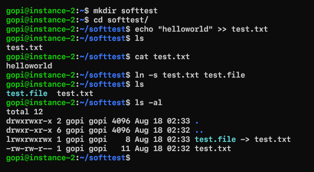
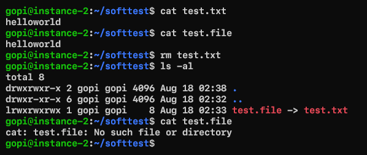
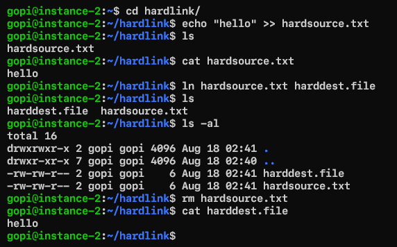
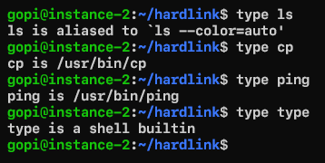
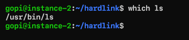

### **Linux Useful utils**  
---
**Which Shell are you running?**  

Execute the command echo $0  

**Aborting and suspending the execution of linux programs**  

- Control-Z suspends the program
- Control-C aborts the program  
**Redirecting output of a command to a file instead of terminal (stdout)**

+ `command > file`
+ Eg: ping -c 4 google.com > pingresults.txt
+ If you want to append the text to existing file use >>
+ Eg: ping -c 10 google.com >> pingresults.txt  

**Redirecting input can be done using < eg: head < /proc/cpuinfo**  

**Common Errors**

+ NO Such file or directory
+ file exists
+ Not a Directory, Is a directory
+ NO space left of device
+ Permission Denied  

**What is softlink (symbolic link) in linux and what is hardlink?**

+ Softlink(symbolic) is an actual link to original file whereas hard link is a mirror copy of original file.
+ If you delete the original file, soft link has no value (since t whatever file it points no longer exists)
+ If you delete the original file, hard link will still has the data of the original file
+ Softlink
 + Can cross the file systems
 + Allows yo to link between directories
 + permissions will not be updated
 + has only the path to original file not contents  

**Hard link**  

+ Can’t cross file system boundaries (it exist on same filesystem)
+ can’t link directories
+ permissions will be updated if we change the source
+ It has contents of original file  

**create a symlink or softlink**  

  

```
ln -s <source file> <dest-file> 
it will create a link to dest-file
```
if you delete the source file its effects the dest-file

  
**create hard link**  

  

**Identifying Commands**  

type: Type is a shell builtin command which displays the kind of command once you give a particular command  
```
type ls
type cp
type ping
type type
```


**which-Display an Executable location**
```
which ls
```
  

**Getting a Commands Documentation**

help: bash has a built-in help facility for each of the shell builtins.  
```
help cd
```
help: Many executable programs support a –help option displays the description of commands  

```
mkdir --help
```
man: Most executable programs intended for command line usage will provide manual  
```
man <command>
man ls
```
apropos-Display appropriate commands  
```
apropos partition
```
info command: This commadn will show mauals with hyperlinked much like web docs  

**Pipelines**  
- Is a capability of commands to read output of command as input to other command
- Generally operator | is referred as pipe
```
command1 | command2
```
Pipelines are often used to perform complex operations on data. It is possible for you to put several commands together into a pipeline
```
 ls -al /bin /usr/bin | sort | less
 ls -al /bin /usr/bin/ | sort | uniq | wc -l
```
**tee**
- tee command will read from stdin and send the output to stdout and files
```
ls -al /bin /usr/bin | tee ls.txt | sort | uniq | wc -l
```